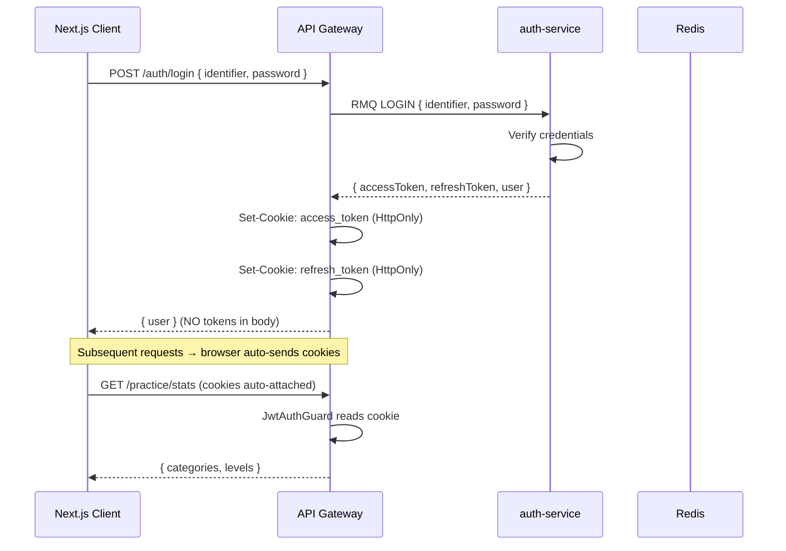
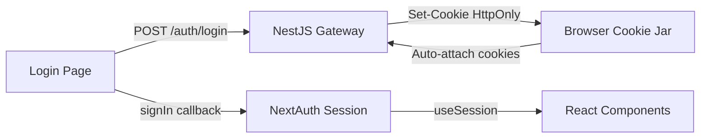

# 🔐 Implementation Plan: HttpOnly Cookie Auth + Google OAuth + Identifier Login

## Tổng quan kiến trúc mới



> [!IMPORTANT]
> Tokens **KHÔNG BAO GIỜ** được trả về trong response body cho client. Gateway nhận tokens từ auth-service rồi gắn vào HttpOnly cookie. Client chỉ nhận được user profile data.

---

## Phase 1: Backend — auth-service Changes

### 1.1 — Prisma Schema: Optional password for social login

**File:** [schema.prisma](file:///Users/dusainbolt/Documents/my-project/my-nestjs-microservices/apps/auth-service/prisma/schema.prisma)

```diff
 model User {
   id              String   @id @default(uuid())
   email           String   @unique
   username        String   @unique
-  password        String
+  password        String?
   firstName       String   @default("")
   lastName        String   @default("")
+  provider        String   @default("local") // "local" | "google"
   role            UserRole @default(user)
   isEmailVerified Boolean  @default(false)
   isActive        Boolean  @default(true)
   createdAt       DateTime @default(now())
   updatedAt       DateTime @updatedAt

   @@map("users")
 }
```

> [!NOTE]
> `provider` field giúp phân biệt user đăng ký bằng email/password ("local") hay Google ("google"). Social users có `password = null`.

### 1.2 — Constants: Add new commands

**File:** [auth.constants.ts](file:///Users/dusainbolt/Documents/my-project/my-nestjs-microservices/libs/common/src/constants/auth.constants.ts)

```diff
 export const AUTH_COMMANDS = {
   PING: 'PING',
   LOGIN: 'LOGIN',
+  GOOGLE_LOGIN: 'GOOGLE_LOGIN',
   REGISTER: 'REGISTER',
   ...
 };
```

### 1.3 — DTO: LoginDto → identifier thay vì email

**File:** [auth.dto.ts](file:///Users/dusainbolt/Documents/my-project/my-nestjs-microservices/libs/common/src/dto/auth.dto.ts)

```diff
 export class LoginDto {
-  @SwaggerEmail()
-  email: string;
+  @SwaggerString({ example: 'johndoe@example.com', description: 'Email or username' })
+  identifier: string;

   @SwaggerString({ example: 'password123' })
   password: string;
 }

+export class GoogleLoginDto {
+  @SwaggerString({ description: 'Google ID token from frontend' })
+  idToken: string;
+}

 export class LoginResponseDto {
   @SwaggerString({ example: 'access-token-123' })
   accessToken: string;

   @SwaggerString({ example: 'refresh-token-123' })
   refreshToken: string;

   @ApiProperty({ example: 3600 })
   expiresIn: number;

-  @SwaggerString({ example: 'Bearer' })
-  tokenType: string;
-
-  @SwaggerString({ example: 'user-id-123' })
-  userId: string;
+  @ApiProperty({ description: 'User profile data' })
+  user: AuthUserResponseDto;
 }
```

> [!TIP]
> `LoginResponseDto` giờ chứa `user` object thay vì chỉ `userId`. Gateway sẽ tách `accessToken` + `refreshToken` ra cookie, chỉ trả `user` về client.

### 1.4 — auth-service.service.ts: Login by identifier + Google Login

**File:** [auth-service.service.ts](file:///Users/dusainbolt/Documents/my-project/my-nestjs-microservices/apps/auth-service/src/auth-service.service.ts)

**Login method changes:**

```diff
-  async login(payload: LoginDto): Promise<LoginResponseDto> {
-    const { email, password } = payload;
-    const user = await this.prisma.user.findUnique({ where: { email } });
-    if (!user || !(await bcrypt.compare(password, user.password)))
-      throw new UnauthorizedException('Invalid email or password');
+  async login(payload: LoginDto): Promise<LoginResponseDto> {
+    const { identifier, password } = payload;
+    const user = await this.prisma.user.findFirst({
+      where: {
+        OR: [{ email: identifier }, { username: identifier }],
+      },
+    });
+    if (!user || !user.password || !(await bcrypt.compare(password, user.password)))
+      throw new UnauthorizedException('Invalid credentials');
```

**New Google Login method:**

```typescript
async googleLogin(payload: GoogleLoginDto): Promise<LoginResponseDto> {
  // 1. Verify Google ID token
  const ticket = await this.googleClient.verifyIdToken({
    idToken: payload.idToken,
    audience: this.config.get('GOOGLE_CLIENT_ID'),
  });
  const googlePayload = ticket.getPayload();
  if (!googlePayload?.email) throw new UnauthorizedException('Invalid Google token');

  // 2. Find or create user
  let user = await this.prisma.user.findUnique({ where: { email: googlePayload.email } });

  if (!user) {
    const username = googlePayload.email.split('@')[0] + '_' + Date.now().toString(36);
    user = await this.prisma.user.create({
      data: {
        email: googlePayload.email,
        username,
        firstName: googlePayload.given_name || '',
        lastName: googlePayload.family_name || '',
        provider: 'google',
        isEmailVerified: true, // Google đã verify email
        password: null,
      },
    });

    // Emit event tạo profile ở user-service
    this.userClient.emit(
      { cmd: USER_COMMANDS.CREATE_PROFILE },
      { id: user.id, email: user.email, username, firstName: user.firstName, lastName: user.lastName },
    );
  }

  return this.generateTokenPair(user);
}
```

**generateTokenPair cần trả thêm user data:**

```diff
 private async generateTokenPair(user): Promise<LoginResponseDto> {
   // ... existing token generation ...
   return {
     accessToken,
     refreshToken: refreshTokenId,
     expiresIn: this.parseExpiresIn(...),
-    tokenType: 'Bearer',
-    userId: user.id,
+    user: {
+      id: user.id,
+      email: user.email,
+      username: user.username,
+      firstName: user.firstName,
+      lastName: user.lastName,
+      role: user.role,
+      isEmailVerified: user.isEmailVerified,
+      isActive: user.isActive,
+      createdAt: user.createdAt,
+    },
   };
 }
```

### 1.5 — auth-service.controller.ts: Add Google Login endpoint

```diff
+  @MessagePattern({ cmd: AUTH_COMMANDS.GOOGLE_LOGIN })
+  googleLogin(@Payload() data: GoogleLoginDto) {
+    return this.authServiceService.googleLogin(data);
+  }
```

---

## Phase 2: API Gateway — Cookie Management

### 2.1 — main.ts: Enable CORS + cookie parser

**File:** [main.ts](file:///Users/dusainbolt/Documents/my-project/my-nestjs-microservices/apps/api-gateway/src/main.ts)

```diff
+import * as cookieParser from 'cookie-parser';

 async function bootstrap() {
   const app = await NestFactory.create(ApiGatewayModule);

+  // Cookie parser để đọc cookies từ request
+  app.use(cookieParser());
+
+  // CORS: cho phép frontend gửi cookies
+  app.enableCors({
+    origin: process.env.FRONTEND_URL || 'http://localhost:3001',
+    credentials: true,
+  });

   // ... existing validation pipe & swagger ...
 }
```

> [!WARNING]
> Phải cài `cookie-parser`: `pnpm add cookie-parser` và `pnpm add -D @types/cookie-parser` trong workspace root.

### 2.2 — Cookie Helper Utility

**New file:** `apps/api-gateway/src/utils/cookie.helper.ts`

```typescript
import { Response } from 'express';

const IS_PRODUCTION = process.env.NODE_ENV === 'production';

export const COOKIE_NAMES = {
  ACCESS_TOKEN: 'access_token',
  REFRESH_TOKEN: 'refresh_token',
} as const;

export function setAuthCookies(
  res: Response,
  accessToken: string,
  refreshToken: string,
  expiresIn: number,
) {
  // Access token: short-lived
  res.cookie(COOKIE_NAMES.ACCESS_TOKEN, accessToken, {
    httpOnly: true,
    secure: IS_PRODUCTION,
    sameSite: IS_PRODUCTION ? 'strict' : 'lax',
    path: '/',
    maxAge: expiresIn * 1000, // convert to ms
  });

  // Refresh token: long-lived (7 days)
  res.cookie(COOKIE_NAMES.REFRESH_TOKEN, refreshToken, {
    httpOnly: true,
    secure: IS_PRODUCTION,
    sameSite: IS_PRODUCTION ? 'strict' : 'lax',
    path: '/auth', // chỉ gửi khi gọi /auth/* endpoints
    maxAge: 7 * 24 * 60 * 60 * 1000,
  });
}

export function clearAuthCookies(res: Response) {
  res.clearCookie(COOKIE_NAMES.ACCESS_TOKEN, { path: '/' });
  res.clearCookie(COOKIE_NAMES.REFRESH_TOKEN, { path: '/auth' });
}
```

### 2.3 — auth.controller.ts: Set cookies on login/refresh, clear on logout

**File:** [auth.controller.ts](file:///Users/dusainbolt/Documents/my-project/my-nestjs-microservices/apps/api-gateway/src/api/auth.controller.ts)

Key changes — login, refresh, logout endpoints wrap the RPC result and manage cookies:

```typescript
// ── Login ──
@Public()
@Post('login')
async login(@Body() body: LoginDto, @Res({ passthrough: true }) res: Response) {
  const result: LoginResponseDto = await firstValueFrom(
    this.authClient.send({ cmd: AUTH_COMMANDS.LOGIN }, body).pipe(rpcToHttp()),
  );

  setAuthCookies(res, result.accessToken, result.refreshToken, result.expiresIn);

  // Chỉ trả user data — KHÔNG trả tokens
  return { user: result.user };
}

// ── Google Login ──
@Public()
@Post('google')
async googleLogin(@Body() body: GoogleLoginDto, @Res({ passthrough: true }) res: Response) {
  const result: LoginResponseDto = await firstValueFrom(
    this.authClient.send({ cmd: AUTH_COMMANDS.GOOGLE_LOGIN }, body).pipe(rpcToHttp()),
  );
  setAuthCookies(res, result.accessToken, result.refreshToken, result.expiresIn);
  return { user: result.user };
}

// ── Refresh ──
@Public()
@Post('refresh')
async refreshToken(@Req() req: Request, @Res({ passthrough: true }) res: Response) {
  const refreshToken = req.cookies?.[COOKIE_NAMES.REFRESH_TOKEN];
  if (!refreshToken) throw new UnauthorizedException('Refresh token missing');

  const result: LoginResponseDto = await firstValueFrom(
    this.authClient.send({ cmd: AUTH_COMMANDS.REFRESH_TOKEN }, { refreshToken }).pipe(rpcToHttp()),
  );

  setAuthCookies(res, result.accessToken, result.refreshToken, result.expiresIn);
  return { user: result.user };
}

// ── Logout ──
@Post('logout')
async logout(@Req() req: Request, @Res({ passthrough: true }) res: Response) {
  const accessToken = req.cookies?.[COOKIE_NAMES.ACCESS_TOKEN];
  const refreshToken = req.cookies?.[COOKIE_NAMES.REFRESH_TOKEN];

  await firstValueFrom(
    this.authClient.send({ cmd: AUTH_COMMANDS.LOGOUT }, { refreshToken, accessToken }).pipe(rpcToHttp()),
  );

  clearAuthCookies(res);
  return { message: 'Logged out successfully' };
}
```

### 2.4 — JwtAuthGuard: Read token from cookie (fallback to header)

**File:** [jwt-auth.guard.ts](file:///Users/dusainbolt/Documents/my-project/my-nestjs-microservices/libs/common/src/guards/jwt-auth.guard.ts)

```diff
-  private extractTokenFromHeader(request: Request): string | undefined {
-    const [type, token] = request.headers.authorization?.split(' ') ?? [];
-    return type === 'Bearer' ? token : undefined;
+  private extractToken(request: Request): string | undefined {
+    // 1. Ưu tiên đọc từ HttpOnly cookie
+    const cookieToken = request.cookies?.['access_token'];
+    if (cookieToken) return cookieToken;
+
+    // 2. Fallback: Authorization header (cho Swagger/mobile/API clients)
+    const [type, token] = request.headers.authorization?.split(' ') ?? [];
+    return type === 'Bearer' ? token : undefined;
   }
```

> [!TIP]
> Giữ fallback `Authorization: Bearer` header để Swagger UI và mobile apps vẫn hoạt động bình thường.

---

## Phase 3: Frontend — NextAuth Integration

### 3.1 — Kiến trúc mới: NextAuth chỉ quản lý session state



- **HttpOnly cookies**: Chứa `access_token` và `refresh_token` — JS không đọc được
- **NextAuth session**: Chỉ chứa user metadata (name, email, role) — KHÔNG chứa tokens
- **API calls**: Browser tự gắn cookies → không cần manually attach Authorization header

### 3.2 — auth.ts: NextAuth authorize gọi backend thật

```typescript
async authorize(credentials) {
  const res = await fetch(`${process.env.NEXT_PUBLIC_API_URL}/auth/login`, {
    method: 'POST',
    headers: { 'Content-Type': 'application/json' },
    credentials: 'include', // QUAN TRỌNG: để nhận Set-Cookie
    body: JSON.stringify({
      identifier: credentials.identifier,
      password: credentials.password,
    }),
  });

  if (!res.ok) {
    const error = await res.json();
    throw new Error(error.message || 'Invalid credentials');
  }

  const { data } = await res.json();
  // Gateway chỉ trả { user }, cookies đã được set tự động
  return {
    id: data.user.id,
    email: data.user.email,
    name: data.user.username,
    username: data.user.username,
    firstName: data.user.firstName,
    lastName: data.user.lastName,
    verified: data.user.isEmailVerified,
  };
}
```

### 3.3 — api-client.ts: Mọi API call dùng `credentials: 'include'`

```typescript
const apiClient = {
  async get(url: string) {
    return fetch(`${API_URL}${url}`, {
      credentials: 'include', // Browser tự gắn cookies
    });
  },
  async post(url: string, body: any) {
    return fetch(`${API_URL}${url}`, {
      method: 'POST',
      headers: { 'Content-Type': 'application/json' },
      credentials: 'include',
      body: JSON.stringify(body),
    });
  },
};
```

---

## Checklist Implementation Order

| #   | Task                                                                 | File(s)                                | Priority |
| --- | -------------------------------------------------------------------- | -------------------------------------- | -------- |
| 1   | Cài `cookie-parser` + `@types/cookie-parser` + `google-auth-library` | `package.json`                         | 🔴       |
| 2   | Update Prisma schema:`password?`, `provider`                         | `auth-service/prisma/schema.prisma`    | 🔴       |
| 3   | Run migration                                                        | terminal                               | 🔴       |
| 4   | Add `GOOGLE_LOGIN` command constant                                  | `libs/common/.../auth.constants.ts`    | 🔴       |
| 5   | Update `LoginDto` (identifier), add `GoogleLoginDto`                 | `libs/common/dto/auth.dto.ts`          | 🔴       |
| 6   | Update `LoginResponseDto` (include user obj)                         | `libs/common/dto/auth.dto.ts`          | 🔴       |
| 7   | Refactor `login()` in auth-service (identifier lookup)               | `auth-service.service.ts`              | 🔴       |
| 8   | Add `googleLogin()` in auth-service                                  | `auth-service.service.ts`              | 🟡       |
| 9   | Add Google endpoint in auth-service controller                       | `auth-service.controller.ts`           | 🟡       |
| 10  | Create `cookie.helper.ts` utility                                    | `api-gateway/utils/`                   | 🔴       |
| 11  | Refactor gateway `auth.controller.ts` with cookie management         | `api-gateway/api/auth.controller.ts`   | 🔴       |
| 12  | Update `JwtAuthGuard` to read from cookies + header                  | `libs/common/guards/jwt-auth.guard.ts` | 🔴       |
| 13  | Update `main.ts`: cookie-parser + CORS credentials                   | `api-gateway/main.ts`                  | 🔴       |
| 14  | Add `FRONTEND_URL`, `GOOGLE_CLIENT_ID` to env                        | `.env` + `env.interface.ts`            | 🟡       |

> [!CAUTION]
> Sau khi chuyển sang cookie-based auth, **mobile apps** sẽ cần dùng fallback `Authorization: Bearer` header. Đảm bảo Guard vẫn hỗ trợ cả hai cơ chế.
